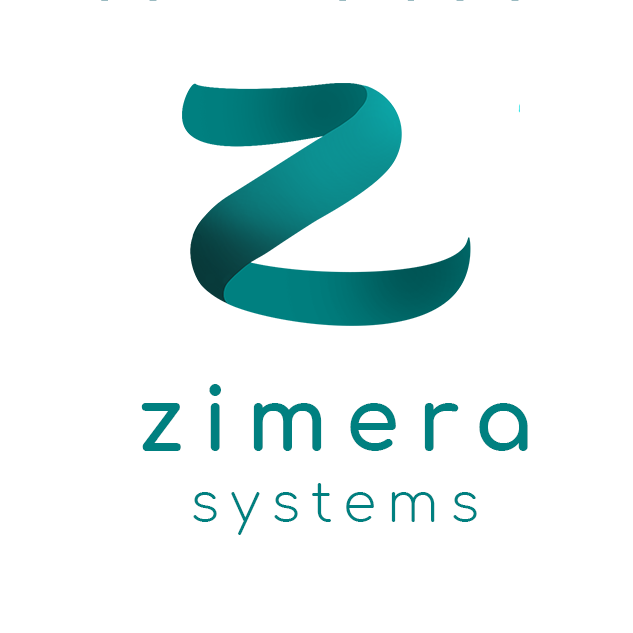

# Zimera - School of Maker in Software and Data Technologies

Repo ini digunakan untuk segala hal yang terkait dengan salah satu aktivitas di Zimera Systems yaitu **School of Maker in Softwware and Data Technologies**. Para pembelajar yang menginginkan untuk mempelajari teknologi software dan data di Zimera Systems bisa mulai dari [Panduan Umum](panduan-umum/). Setelah itu bisa masuk ke [Materi Pembelajaran](materi-pembelajaran).

Semua materi yang terdapat pada Zimera Systems mempunyai lisensi Apache 2.0 (untuk software) dan CC-BY-SA 4.0 Internasional untuk materi pembelajaran.

